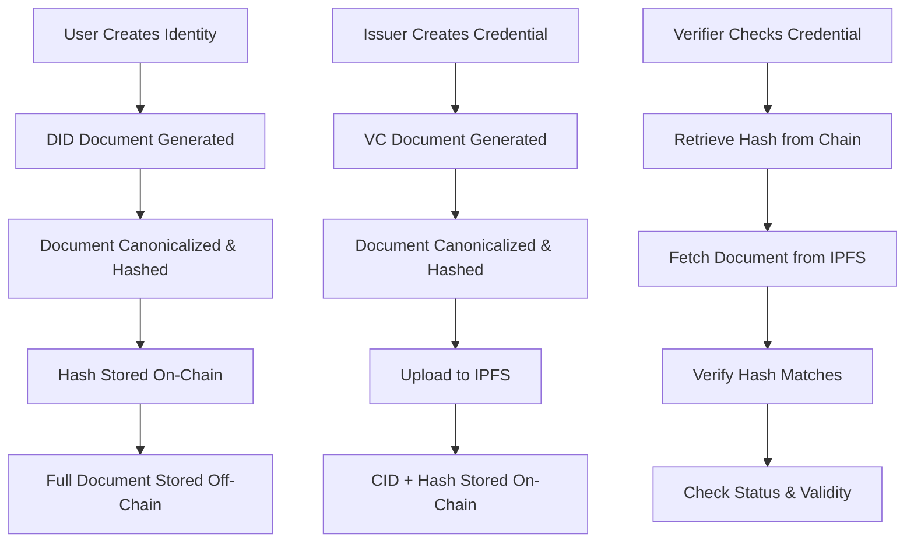

# 🆔 DID-Geth: Self-Sovereign Identity on Private Ethereum

> **A complete Self-Sovereign Identity (SSI) blockchain system implementing W3C DID Core and Verifiable Credentials standards on a private Ethereum network using Geth with Clique PoA consensus.**

[](https://opensource.org/licenses/MIT)
[](https://ethereum.org/)
[](https://soliditylang.org/)
[](https://docs.docker.com/compose/)

---

## 🎯 What is DID-Geth?

Think of **DID-Geth** as a **digital identity passport system** for the blockchain era. Just like how a government issues physical passports to verify your identity when traveling, this system allows organizations to issue **digital credentials** that people can control and verify independently, without needing to ask the original issuer every time.

### 🔍 Real-World Analogy

Imagine a university that wants to issue digital diplomas:

```
Traditional System (Centralized):
Student → Requests transcript → University database → Verifies directly

DID-Geth System (Decentralized):
University → Issues VC → Student controls → Anyone can verify independently
     ↓                       ↓                        ↓
  (Issuer)                (Holder)               (Verifier)
```

## 🏗️ System Architecture

## Architecture Overview

This project implements a **permissioned Ethereum blockchain** using **Go-Ethereum (Geth)** with **Clique Proof-of-Authority (PoA)** consensus, specifically designed for a **Self-Sovereign Identity (SSI) and Decentralized Identifier (DID) management system** following the **Trust Triangle approach**.

### 🔼 The SSI Trust Triangle

This system implements the **Trust Triangle** pattern - the fundamental relationship model in Self-Sovereign Identity:

```
                    ┌─────────────┐
                    │   TRUSTEE   │ ←─── System Governance
                    │(Governance) │      • Role Management
                    └──────┬──────┘      • System Oversight
                           │             • Policy Enforcement
                           │
                           ▼
                    ┌─────────────┐      ┌─────────────┐
                    │   ISSUER    │ ────▶│   HOLDER    │
                    │(Credentials)│      │ (Identity)  │
                    └─────────────┘      └─────────────┘
                           │                     │
                           ▼                     ▼
                    Issues Digital        Controls Their
                    Credentials          Digital Identity
```

### 🏗️ Network Architecture

The system runs on a **private Ethereum network** optimized for identity operations:

```
┌─────────────────────────────────────────────────────────────────┐
│                 Geth Clique PoA Network                         │
│                (172.16.239.0/24 subnet)                         │
├─────────────────────────────────────────────────────────────────┤
│                                                                 │
│  ┌──────────────┐    ┌─────────────────────────────────────┐    │
│  │   Bootnode   │    │              Validators             │    │
│  │ (.10:30301)  │◄──►│  V1(.11)  V2(.12)  V3(.13)  V4(.14) │    │
│  └──────────────┘    └─────────────────────────────────────┘    │
│                                    ▲                            │
│  ┌──────────────┐     ┌────────────┴──┐   ┌─────────────────┐   │
│  │  Web3Signer  │ ──► │    RPC Node   │   │   Monitoring    │   │
│  │ (.40:18545)  │     │   (.15:8545)  │   │   (Optional)    │   │
│  └──────────────┘     └───────────────┘   └─────────────────┘   │
└─────────────────────────────────────────────────────────────────┘
```

## 🧩 Core Components

### 1. 🔐 Smart Contracts (The Digital Rulebook)

| Contract | Purpose | Analogy |
|----------|---------|---------|
| **RoleControl** | Manages who can do what in the system | *Government departments with different permissions* |
| **DidRegistry** | Stores digital identity documents | *National ID registry database* |
| **CredentialRegistry** | Manages verifiable credentials | *Professional certification board* |

### 2. 🌐 Network Layer (The Infrastructure)

- **Geth Nodes**: Like bank branches - multiple locations ensuring system availability
- **Clique PoA**: Like a board of directors - trusted validators who approve transactions
- **Web3Signer**: Like a secure key vault - safely manages cryptographic signatures

### 3. 📁 Storage Integration

- **On-Chain**: Critical metadata and hashes (like a card catalog)
- **IPFS**: Full credential documents (like the actual books in a library)

## 📁 Directory Structure

```
did-geth/
├── 📁 network/                          # Blockchain Network Infrastructure
│   ├── 📁 config/                       # Network Configuration Files
│   │   ├── 📁 geth/                     # Geth Node Configurations
│   │   │   ├── genesis.json             # Clique PoA genesis block definition
│   │   │   ├── config.toml              # Geth TOML configuration template
│   │   │   ├── static-nodes.json        # P2P static node discovery list
│   │   │   ├── password.txt             # Default account password
│   │   │   └── bootnode/                # Bootnode discovery keys (generated)
│   │   │
│   │   ├── 📁 nodes/                    # Individual Node Credentials
│   │   │   ├── validator1/              # Validator 1 keys & accounts
│   │   │   ├── validator2/              # Validator 2 keys & accounts  
│   │   │   ├── validator3/              # Validator 3 keys & accounts
│   │   │   ├── validator4/              # Validator 4 keys & accounts
│   │   │   └── rpcnode/                 # RPC node keys & accounts
│   │   │
│   │   └── 📁 web3signer/               # Transaction Signing Service
│   │       ├── config.yaml              # Web3Signer configuration
│   │       ├── keys/                    # YAML key configurations
│   │       └── password                 # Signing service password
│   │
│   ├── 📁 scripts/                      # Network Management Scripts
│   │   ├── geth-run.sh                  # Start the blockchain network
│   │   ├── geth-stop.sh                 # Stop the network gracefully
│   │   ├── geth-restart.sh              # Restart network services
│   │   ├── geth-resume.sh               # Resume stopped containers
│   │   ├── geth-remove.sh               # Completely remove network
│   │   ├── geth-list.sh                 # List all endpoints & services
│   │   └── geth-common.sh               # Shared utility functions
│   │
│   ├── 📁 tools/                        # Development & Maintenance Tools
│   │   ├── generate_node_details.js     # Generate node credentials
│   │   └── package.json                 # Node.js dependencies
│   │
│   └── 📁 logs/                         # Persistent Service Logs
│       ├── geth/                        # Geth node operation logs
│       └── web3signer/                  # Web3Signer transaction logs
│
├── 📁 smart-contracts/                  # SSI Smart Contract System
│   ├── 📁 contracts/                    # Solidity Smart Contracts
│   │   ├── 📁 auth/                     # Authentication & Role Management
│   │   │   ├── AuthErrors.sol           # Custom error definitions
│   │   │   ├── IRoleControl.sol         # Role control interface
│   │   │   └── RoleControl.sol          # Trust triangle role implementation
│   │   │
│   │   ├── 📁 did/                      # DID Registry (W3C DID Core)
│   │   │   ├── DidErrors.sol            # DID-specific error definitions
│   │   │   ├── DidTypeNew.sol           # DID data structures
│   │   │   ├── IDidRegistry.sol         # DID registry interface
│   │   │   └── DidRegistry.sol          # DID registry implementation
│   │   │
│   │   └── 📁 vc/                       # Verifiable Credentials (W3C VC v2.0)
│   │       ├── CredentialErrors.sol     # VC-specific error definitions
│   │       ├── CredentialType.sol       # VC data structures
│   │       ├── ICredentialRegistry.sol  # VC registry interface
│   │       └── CredentialRegistry.sol   # VC registry implementation
│   │
│   ├── 📁 scripts/                      # Deployment & Management Scripts
│   │   ├── deploy.js                    # Complete system deployment
│   │   ├── assign-issuer-role.js        # Assign issuer privileges
│   │   ├── assign-holder-role.js        # Assign holder privileges
│   │   ├── web3signer-create-dids.js    # Create DIDs via Web3Signer
│   │   └── web3signer-issue-creds.js    # Issue VCs via Web3Signer
│   │
│   ├── hardhat.config.js                # Hardhat development environment
│   ├── package.json                     # Smart contract dependencies
│   └── .gitignore                       # Contract-specific ignore rules
│
├── docker-compose.yml                   # Container orchestration definition
├── .env                                 # Environment variables & versions
├── .gitignore                          # Repository ignore patterns
├── LICENSE                             # MIT license terms
└── README.md                           # Project documentation
```

## 🚀 Quick Start Guide

### Prerequisites

- Docker Engine 20.10+
- Docker Compose v2.0+
- 8GB+ RAM
- 25GB+ disk space
- Node.js 16+ (for smart contract development)

### 1. 🐳 Launch the Network

```bash
# Clone the repository
git clone https://github.com/novaldypratama/did-geth.git
cd did-geth
cd network/scripts

# Start the entire network with one command
./geth-run.sh

### 2. 📋 Check Network Status

```bash
# View running services
./network/scripts/geth-list.sh

# Monitor network health
docker-compose ps
```

### 3. 🏗️ Deploy Smart Contracts

```bash
cd smart-contracts

# Install dependencies
npm install
# Or
pnpm install

# Deploy the complete SSI system
npx hardhat run scripts/deploy.js --network localhost
# Or
pnom exec hardhat run scripts/deploy.js --network localhost
```

### 4. 👥 Set Up Roles

```bash
# Assign an Issuer role (organizations that issue credentials)
npx hardhat run scripts/assign-issuer-role.js --network localhost
# Or
pnpm exec hardhat run scripts/assign-issuer-role.js --network localhost

# Assign a Holder role (individuals who receive credentials)
npx hardhat run scripts/assign-holder-role.js --network localhost
# Or
pnpm exec hardhat run scripts/assign-holder-role.js --network localhost
```

### 5. 🆔 Create Digital Identities

```bash
# Create DID documents for issuer and holder
npx hardhat run scripts/web3signer-create-dids.js --network localhost
# Or
pnpm exec hardhat run scripts/web3signer-create-dids.js --network localhost
```

### 6. 📜 Issue Your First Credential

```bash
# Issue a verifiable credential
npx hardhat run scripts/web3signer-issue-creds.js --network localhost
# Or
pnpm exec hardhat run scripts/web3signer-issue-creds.js --network localhost
```

## 📚 Detailed Architecture

### Smart Contract Layer

#### 🔐 RoleControl: The Authorization System

Think of this as the **HR department** of your digital identity system:

```solidity
enum ROLES {
    EMPTY,    // No role assigned
    ISSUER,   // Can issue credentials (like a university)
    HOLDER,   // Can receive credentials (like a student)  
    TRUSTEE   // System admin (like a superintendent)
}
```

**Key Features:**
- Hierarchical role management
- Gas-optimized storage patterns
- Event-driven role changes

#### 🆔 DidRegistry: The Identity Foundation

Like a **government ID registry**, but decentralized:

```solidity
struct DidRecord {
    bytes32 docHash;        // Cryptographic fingerprint
    DidMetadata metadata;   // Creation date, owner, status
}
```

**Standards Compliance:**
- ✅ W3C DID Core v1.0 specification
- ✅ JSON Canonicalization Scheme (JCS) for consistent hashing
- ✅ Meta-transaction support for gasless operations

#### 📜 CredentialRegistry: The Credential Manager

Functions like a **digital diploma mill** (but legitimate):

```solidity
struct CredentialRecord {
    bytes32 credentialHash;      // Unique credential identifier
    address issuer;              // Who issued this credential
    CredentialMetadata metadata; // When, status, expiration
}
```

**Standards Compliance:**
- ✅ W3C DID VC Data Model v2.0 specification
- ✅ JSON Canonicalization Scheme (JCS) for consistent hashing
- ✅ Meta-transaction support for gasless operations

**Advanced Features:**
- IPFS integration for credential storage
- Status management (Active, Suspended, Revoked)
- Cryptographic integrity verification

### Data Flow Architecture



## 🔧 Development Workflow

### Setting Up Your Development Environment

```bash
# 1. Network Setup
cd did-geth
cd network/scripts
./geth-run.sh

# 2. Smart Contract Development
cd smart-contracts
npm install
# Or
pnpm install

npx hardhat compile
# Or
pnpm hardhat compile

# 3. Testing
npx hardhat test
# Or
pnpm exec hardhat test

# 4. Deployment
npx hardhat run scripts/deploy.js --network localhost
# Or
pnpm exec hardhat run scripts/deploy.js --network localhost
```

### Understanding Gas Optimization

Our contracts are optimized for minimal gas usage:

| Operation | Gas Cost | Optimization Strategy |
|-----------|----------|----------------------|
| Role Assignment | ~75,000 | Struct packing |
| DID Creation | ~100,000 | Efficient storage slots |
| Credential Issue | ~200,000 | IPFS offloading |

### Key Design Patterns

1. **Storage Packing**: Related data grouped to minimize storage slots
2. **Event-Driven Architecture**: Minimal on-chain data, rich event logs
3. **Modular Design**: Separated concerns for easier upgrades

## 🔒 Security Considerations

### Access Control Matrix

| Role | Create DID | Issue Credential | Manage Roles | System Admin |
|------|------------|------------------|--------------|--------------|
| HOLDER | ✅ (own) | ❌ | ❌ | ❌ |
| ISSUER | ✅ (own) | ✅ | ❌ | ❌ |
| TRUSTEE | ✅ (any) | ✅ | ✅ | ✅ |

### Best Practices

1. **Private Key Management**: Use Web3Signer for production
2. **Network Security**: Private network with controlled access
3. **Data Privacy**: Personal data stored off-chain (IPFS)
4. **Audit Trail**: All operations logged via blockchain events

## 🛠️ Troubleshooting

### Common Issues

**Network won't start:**
```bash
# Clean up and restart
./network/scripts/geth-stop.sh
./network/scripts/geth-remove.sh
./network/scripts/geth-run.sh
```

**Contract deployment fails:**
```bash
# Check network connection
curl -X POST -H "Content-Type: application/json" \
  --data '{"jsonrpc":"2.0","method":"net_version","params":[],"id":1}' \
  http://localhost:8545
```

## 🗺️ Roadmap & Future Enhancements

### Phase 1: Core Infrastructure ✅
- [x] Private Ethereum network
- [x] Smart contract suite
- [x] Basic DID operations
- [x] Credential issuance
- [ ] Caliper benchmarking

### Phase 2: Advanced Features 🚧
- [ ] Versioning and key rotation
- [ ] Revocation registry management
- [ ] Verifiable presentations registry
- [ ] Cross-chain compatibility
- [ ] UI/Mobile wallet integration

### Phase 3: Production Readiness 📋
- [ ] Comprehensive monitoring
- [ ] Load/Stress testing
- [ ] Security audit
- [ ] Documentation completion